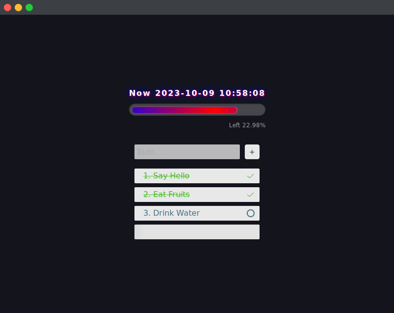
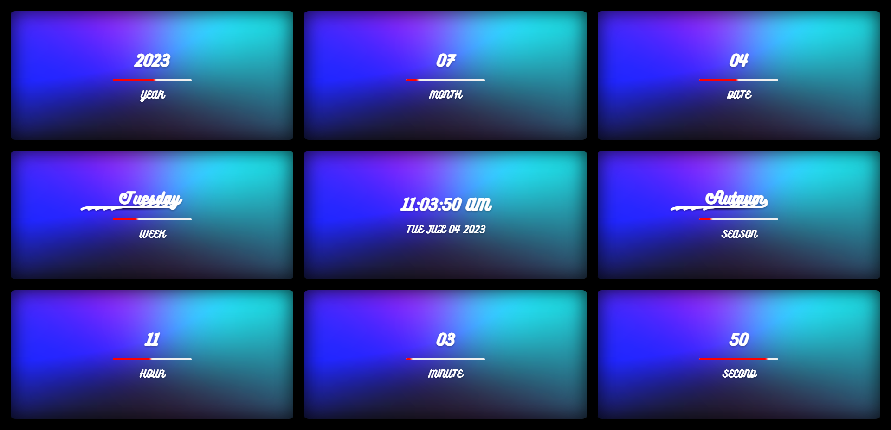
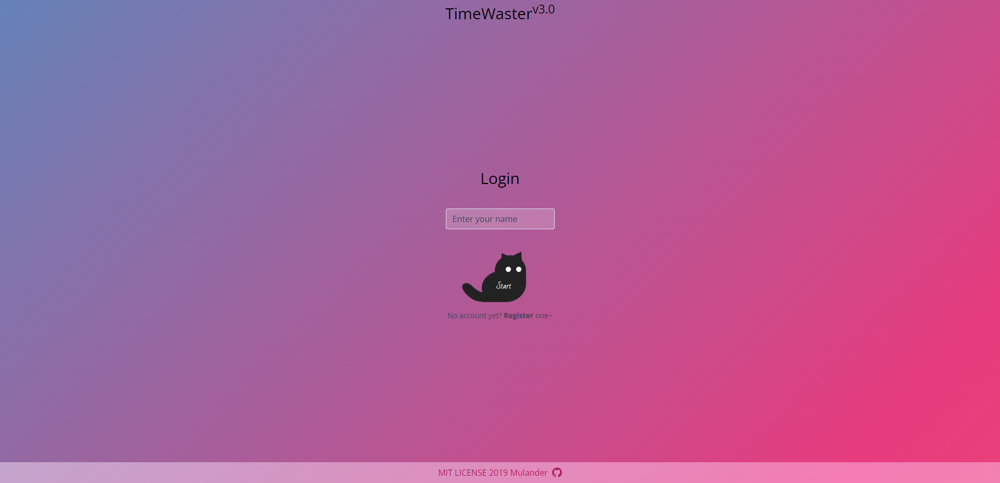
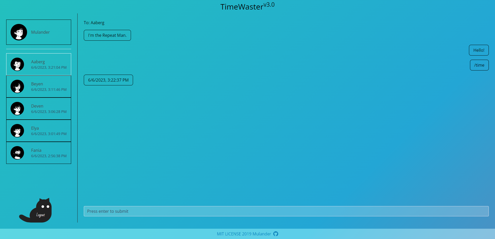
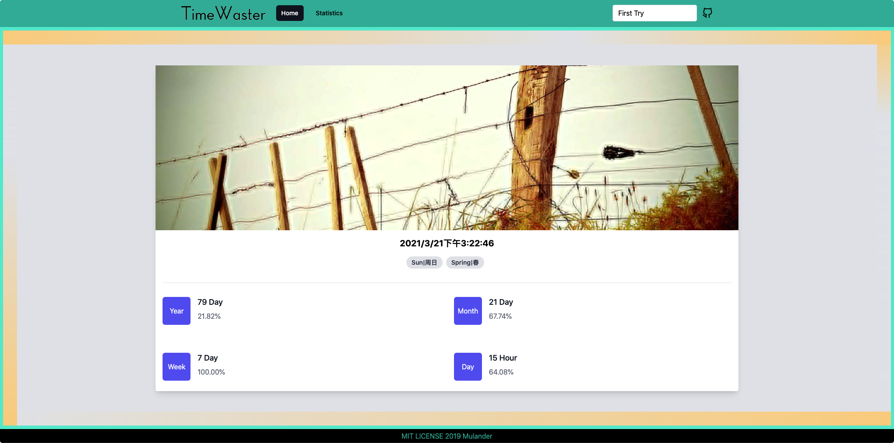

# TimeWaster `v5.0.0`

Practice project based on different technology stacks.


## Previews
> If the old version is displayed, you can empty cache & hard reload or unregister the service-worker.

### `v5.0.0`

- [Tauri](https://tauri.app/zh-cn/) + [Svelte](https://svelte.dev/) + [Rust](https://www.rust-lang.org/)
- SvelteKit + Vite




### `v4.0.0`

- AssemblyScript
- ReactApp + Vite
- TailwindCSS + Framer Motion + Emotion
- TS + Prettier + Eslint + Husky

```bash
rustup toolchain install stable-x86_64-pc-windows-msvc
rustup default stable-x86_64-pc-windows-msvc
# serve via tauri
pnpm tauri dev
# build release
pnpm tauri build --target x86_64-pc-windows-msvc  
```




### `v3.0.0`

- Vue3 + Pug
- TS + Vite + Turbo
- UnoCSS + Sass




### `v2.0.0`

Vue3 + Vite + WindiCSS



### `v1.0.0`

Vue2


## Build Setup

``` bash
# install dependencies
pnpm install

# serve with hot reload at localhost:8080
pnpm run dev

# build for production with minification
pnpm run build

# build for production and view the bundle analyzer report
pnpm run build --report
```
