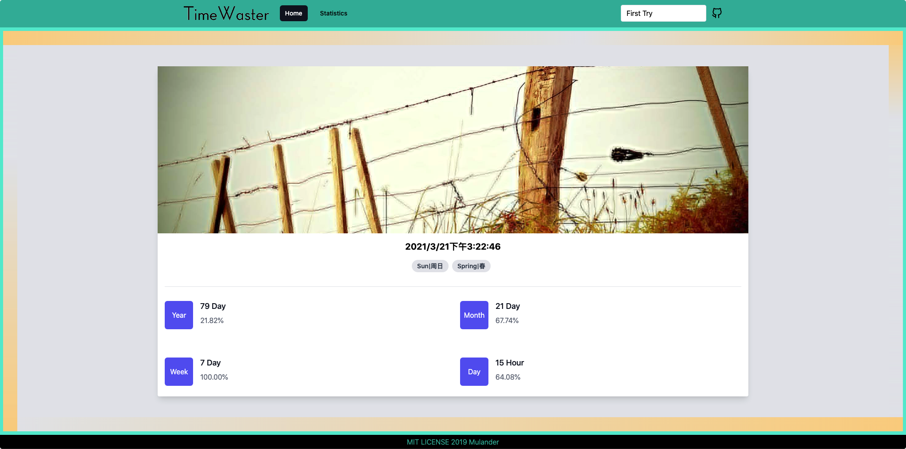

# TimeWaster `v2.0.0`

> waste your time reading this md which tells u how to waste time


## 项目说明

该项目为web单页面应用，核心功能为显示时间。

技术栈使用 [pnpm](https://pnpm.js.org/)、[Vite](https://github.com/vitejs/vite)、[Vue3](https://v3.vuejs.org/)、[typescript](https://www.typescriptlang.org/docs/handbook/release-notes/typescript-4-0.html)、[tailwind](https://tailwindcss.com/docs)、[github/api](https://docs.github.com/en/rest)

### 功能需求
- 显示时间
- 显示随机壁纸
- 每日热词录入

### 非功能需求
- 移动端自适应
- 查看日前时间详细属性

## 页面对比
> [新项目预览](https://mulander-j.github.io/timeWaster/#/home)
> [旧项目预览](https://mulander-j.github.io/fillory/repoPage/twaster/index.html#/)

旧页面

新页面


## 开发记录
> Vscode Extension
> - Vue 3 Pack
> - Vue Extension Pack
> - Tailwind CSS Extension Pack

### alias设置
> '@'默认生效、其他路径需要同时配置vite和typescript才生效，配置完最好重启ide


1.配置vite.config文件
```typescript
{
resolve: {
    alias: {
      '@': path.resolve(__dirname, './src'),
      '#': path.resolve(__dirname, './src/views'),
      '$': path.resolve(__dirname, './src/components'),
    },
  }
}
```
2.配置tsconfig.json文件
```json
{
 "compilerOptions": {
    "paths": {
      "/@/*": ["src/*"],
      "/#/*": ["src/views/*"],
      "/$/*": ["src/components/*"]
    }
  },
}
```
### script setup
```
<script setup lang="ts">
  import { reactive, watchEffect, computed, ref } from 'vue';
  import gitPut from '$/gitPut.vue'; // 组件引入即可直接使用，不需要componet注册
  //    以下变量都可以在template中使用
  const menu = [...routes];     //非动态绑定
  const menuShow = ref(false);  //动态绑定，set/get时需要使用menuShow.value
  const state = reactive({  //动态绑定。类似store/state，维护一组参数
       imgUrl: '',
       now: Date.now(),
       twDate: computed(() => new TwDate(state.now)),
       /*使用computed替代filter*/
       weekMix: computed(() => state.twDate.getWeekEn() + '|' + state.twDate.getWeekZh()),
       seasonMix: computed(() => state.twDate.getSeasonEn() + '|' + state.twDate.getSeasonZh()),
  })
  //  watchEffect,  区别于watch只监听一个变量
  watchEffect(() => {
    //  可以定义所有变量监听，此处只监听了state.now
    state.localStr = new TwDate(state.now).toLocaleString();
  });
<script/>
```
### 随机图片地址
> [reference](https://github.com/ccbikai/vue-random-pic/blob/master/index.js)

[unsplash](https://unsplash.dogedoge.com/):免费的高清摄影素材网站
```
  const api = 'https://unsplash.it';
  const randomId = Math.random() * 10;
  const width = 1920;
  const height = 1080;
  let url = `${api}/${width}/${height}?random=${parseInt(randomId.toString(), 10)}`;
```
P.S.
也可用利用api获取Bing壁纸，但因为要处理跨域放弃了。如果是独立部署的话可以考虑。
```
// const bingUrl = 'https://cn.bing.com/HPImageArchive.aspx?format=js&idx=0&n=1&mkt=zh-CN';
```
### tailwind使用
因为目前使用的是quasar框架，其中也有一些原子类的样式，所以思维上还是能理解。

但不习惯api的话起手比较吃力，有一定门槛，对与团队推行还是有一定难度。

个人感觉作为项目落地的话未来可能会有使用上的瓶颈，作为个人开发的话我目前还是比较中意的，有种中庸之美。
### github/api
每日热词需求由 `github/issue` 实现，即输入热词回车后将参数由`github/api`传递给github。
写入操作需要token验证，可以在github/开发者设置里创建。
因为token不可显性显示在代码中，所以对token采用非对称加密，每次请求要输入密钥，解码后获取token。
    P.S.如果token直接暴露在代码中，该token会自动删除。
1.创建token，输入note即可，checkbox勾选repo即可
2.在github/repo/issue里创建新label，主要用于区分。
3.配置用户、项目 `package.json`
```json
{
  "config": {
    "owner": "Mulander-J",
    "repo": "timeWaster",
    "label": "heart"
  }
}
```
4.config of github/api/token
> require pubKey、priKey、token
```
//  ./util/auth.ts
const pubKey = 'XXXXXXX' // 公钥地址-来自加密算法
const authText = 'XXXXXXX'  //  加密的token，来自github设置-创建token
```

## 打包及部署
打包前要根据仓库地址修改根目录属性
```typescript
// [guide](https://vitejs.dev/config/)
export default defineConfig({
  base: '/timeWaster'
});

```
使用github-page部署，这里用到了`gh-pages`插件，两行命令直接部署。
```json
{
  "scripts": {
    "dev": "vite",
    "build": "vite build",
    "serve": "vite preview",
    "predeploy": "vite build",
    "deploy": "gh-pages -d dist"
  },
  "devDependencies": {
    "gh-pages": "^3.1.0"
  },
}
```

## Build Setup

```bash
# install pnpm
npm install pnpm -g

# install dependencies
pnpm install

# serve with hot reload at localhost:8080
pnpm dev

# build for production with minification
pnpm build

```
